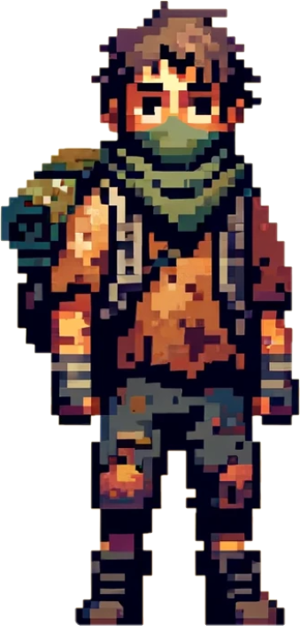
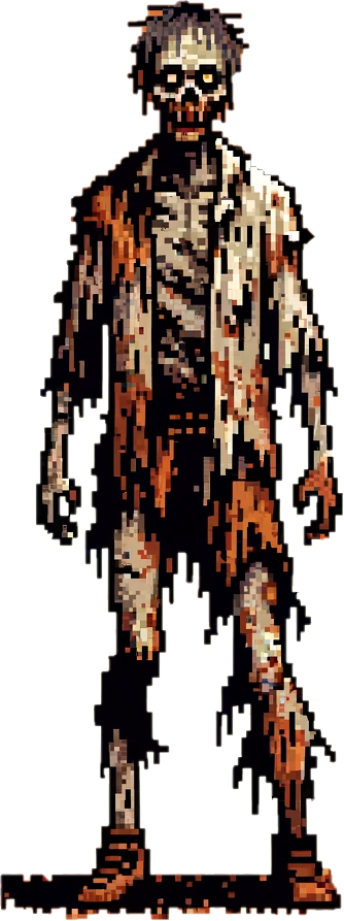
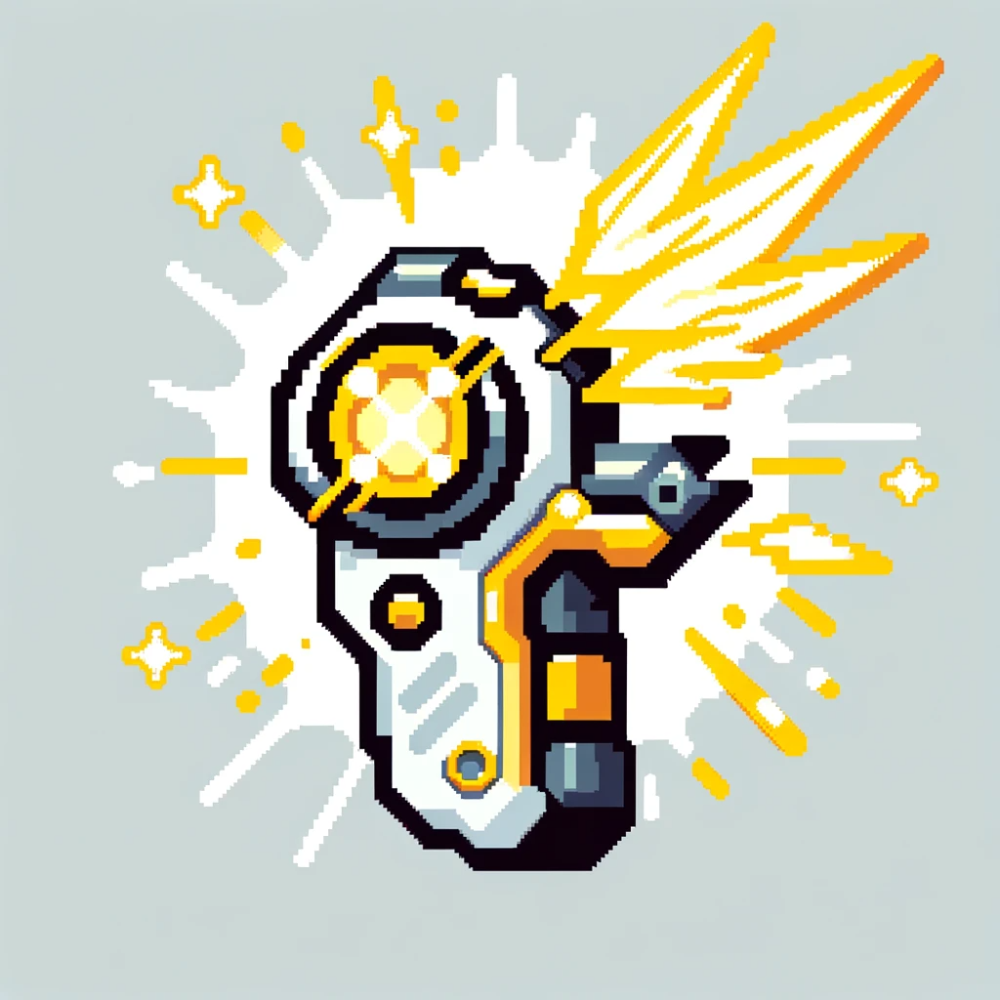
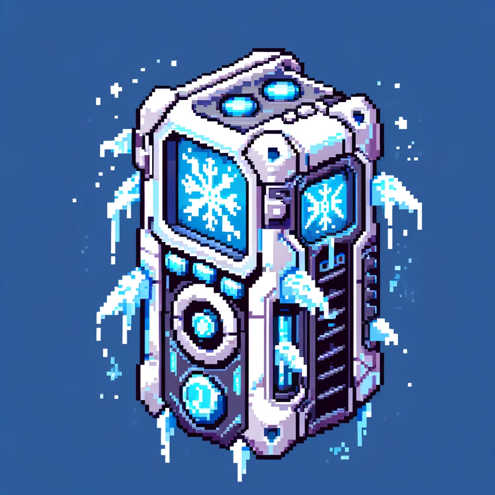
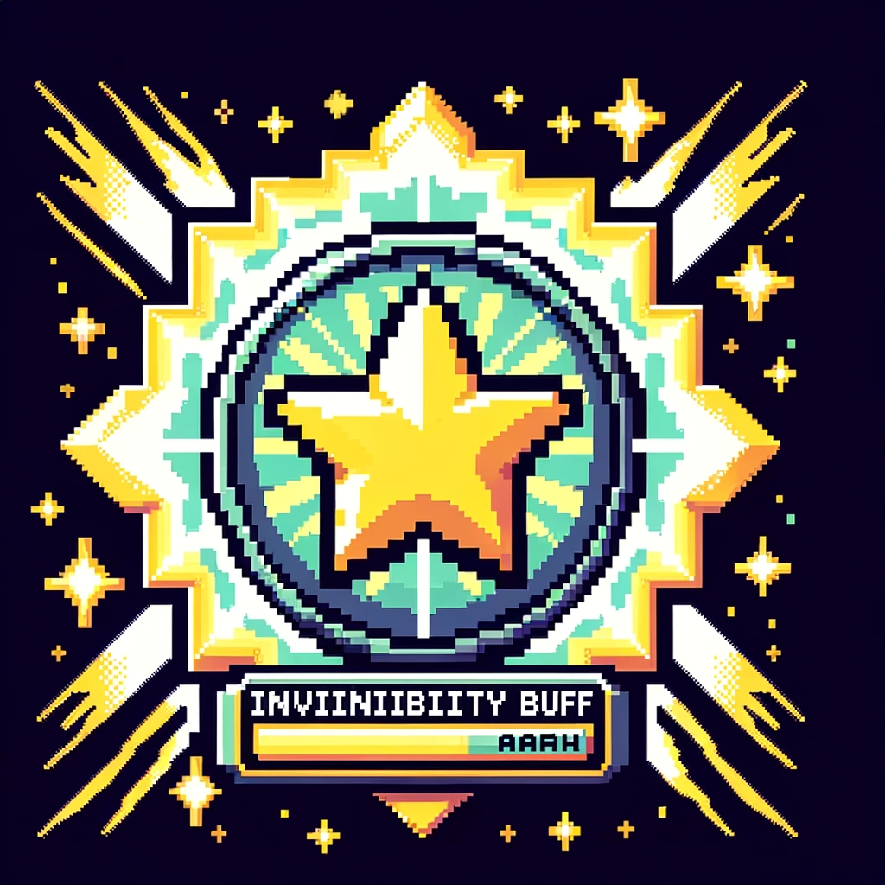
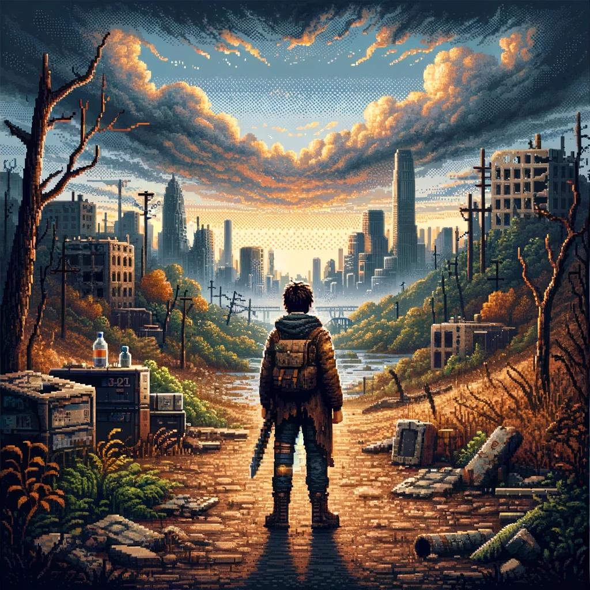

<a name="readme-top"></a>

<!-- PROJECT SHIELDS -->
<!--
*** I'm using markdown "reference style" links for readability.
*** Reference links are enclosed in brackets [ ] instead of parentheses ( ).
*** See the bottom of this document for the declaration of the reference variables
*** for contributors-url, forks-url, etc. This is an optional, concise syntax you may use.
*** https://www.markdownguide.org/basic-syntax/#reference-style-links
-->
[![Contributors][contributors-shield]][contributors-url]
[![Forks][forks-shield]][forks-url]
[![Stargazers][stars-shield]][stars-url]
<!-- [![MIT License][license-shield]][license-url] -->

# Battle Royale

> MIS 109403019 鄒翔宇, MIS 109403021 傅珩洵

<!-- 中英版文件 -->
<!-- @TODO -->
<!-- [English](./README.md) | [中文](./README_zh.md) -->

<br />
<div align="center">
  <a href="https://github.com/xxrjun/battle-royale">
    
  </a>

  <h3 align="center">Battle Royale Game</h3>

  <p align="center">
     NCU Assembly | Fall 2023 | Final Project
    <br />
    <a href="./docs/development.adoc"><strong>Explore the devlopement docs »</strong></a>
    <br />
    <br />
    <!-- <a href="">View Demo</a> -->
  </p>
</div>


## 目錄
- [目錄](#目錄)
- [遊戲規則](#遊戲規則)
  - [基本資訊](#基本資訊)
  - [角色設定](#角色設定)
  - [遊戲結束條件](#遊戲結束條件)
  - [道具系統](#道具系統)
- [開始遊戲](#開始遊戲)
  - [下載專案](#下載專案)
  - [直接執行](#直接執行)
  - [使用 Makefile 進行編譯](#使用-makefile-進行編譯)
- [遊戲流程](#遊戲流程)
- [專案架構](#專案架構)
  - [目錄結構](#目錄結構)
  - [程式架構](#程式架構)
- [開發工具](#開發工具)
  - [程式開發](#程式開發)
  - [影音素材](#影音素材)
- [貢獻者](#貢獻者)

## 遊戲規則

> *Note: 斜線表示之數值會依據遊戲體驗進行調整*

### 基本資訊

- **遊戲模式**：單人遊戲（未來會考慮加入雙人模式）
- **玩家目標**：獲得高分，分數會隨著時間持續累加，存活越久分數會越高。

### 角色設定

  <table border="1">
      <tr>
          <th>角色</th>
          <th>描述</th>
          <th>外觀</th>
      </tr>
      <tr>
          <td>倖存者</td>
          <td>玩家操控的角色。單人遊戲時使用 <b>WASD</b> 鍵控制。<br/>倖存者的目標是躲避殭屍，避免觸碰到殭屍導致死亡。</td>
          <td></td>
      </tr>
      <tr>
          <td>殭屍</td>
          <td>皆由電腦控制，遊戲開始時有一隻，每隔 <i>10</i> 秒會從固定位置增加一隻，<br/>最多增加到 <i>15</i> 隻。每隻殭屍速度不一且隨機，殭屍會持續往倖存者的位置移動。</td>
          <td></td>
      </tr>
  </table>


### 遊戲結束條件

> GG! Next life!

倖存者被殭屍觸碰到，便會死亡，遊戲結束。

### 道具系統

> 遊戲過程中，每 *7.5* 秒，會隨機生成類的以下其中一個道具，玩家可以拾取道具獲得暫時的增益效果

<table border="1">
    <tr>
        <th>道具</th>
        <th>描述</th>
        <th>外觀</th>
    </tr>
    <tr>
        <td>閃電</td>
        <td>玩家移動加速 <i>3</i> 秒</td>
        <td></td>
    </tr>
    <tr>
        <td>冰凍</td>
        <td>所有殭屍暫停移動 <i>3</i> 秒</td>
        <td></td>
    </tr>
    <tr>
        <td>無敵</td>
        <td>玩家觸碰到殭屍不會結束遊戲，持續 <i>3</i> 秒</td>
        <td></td>
    </tr>
    <tr>
        <td>鈔票</td>
        <td>分數累加速度加快 <i>3</i> 秒</td>
        <td></td>
    </tr>
</table>


## 開始遊戲

### 下載專案

```bash
git clone git@github.com:xxrjun/battle-royale.git
# or
git clone https://github.com/xxrjun/battle-royale.git
```

### 直接執行

```bash
cd battle-royale/bin
battle_royale.exe 
# or
./battle_royale.exe
```

也可以打開資料夾找到 `battle_royale.exe` 並執行

<div align="center">
  
</div>

### 使用 Makefile 進行編譯

> 需要安裝 [MASM32](https://www.masm32.com/index.htm)

```bash
make # or make all
```


## 遊戲流程

@TODO

## 專案架構

### 目錄結構

```bash
battle-royale/
│
├── src/                    # 源代碼目錄
│   └── battle_royale.asm   # 主程式
│
├── bin/                    # 編譯後的二進制文件和可執行文件
│   └── battle_royle.exe    # 可執行文件
│
├── docs/                   # 文件目錄
│   └── development.md      # 開發相關文檔
│
├── assets/                 # 資源文件，如圖像、音效等
│   ├── docs/               # 文件用圖像 
│   ├── images/             # 遊戲用圖像
│   └── sounds/             # 遊戲用音效
│
├── Makefile                # 編譯腳本
├── README.md               # 專案說明文件
└── .gitignore              # Git忽略文件配置
```

### 程式架構

<div align="center">
  
</div>
<br>

- **WinMain**: 程序的主入口點。負責初始化應用程序並進入消息循環。
- **WndProc**: 處理窗口消息的過程。
- **TopXY**: 計算窗口在屏幕上的位置。
- **generateRandomNum**: 生成範圍內的隨機數。
- **initGameplay**: 初始化遊戲的主要變數。
- **paintBackground**: 繪製遊戲背景。
- **paintScoreBar**: 繪製分數條。
- **paintPlayer**: 繪製玩家角色。
- **paintZombie**: 繪製所有殭屍。
- **playSound**: 播放聲音。
- **paintGadget**: 繪製遊戲中的道具。
- **updateScrenn**: 更新遊戲畫面。
- **updatePlayerPosition**: 更新玩家位置。
- **activateZombie**: 激活一隻新的殭屍。
- **updateZombiePositions**: 更新所有殭屍的位置。
- **checkZombieCollision**: 檢查殭屍與玩家之間的碰撞。
- **checkGadgetCollision**: 檢查道具與玩家之間的碰撞。
- **checkBuffEffect**: 檢查道具效果。
- **ThreadProc**: 遊戲主循環的線程過程。


## 開發工具

### 程式開發

- [MASM32 SDK](https://www.masm32.com/index.htm) - 工具集，包含 assembler、editor、linker 等工具
  - Assembler: `ml.exe` 用於將組合語言源代碼轉換成機器代碼。
  - Linker: `link.exe` 用於將組譯器產生的對象檔案連結成可執行檔案。
- [Visual Studio Code](https://code.visualstudio.com/), [MASM Editor](https://www.masm32.com/) - 編輯器，用於編寫組合語言程式碼
- [ChatGPT](https://chat.openai.com/) with GPT4.0 - 協作工具，詢問程式碼、開發問題等
- [draw.io](https://app.diagrams.net/) - 繪圖工具，用於繪製專案架構、流程圖

### 影音素材

- [DALL·E](https://openai.com/dall-e-3) - 圖片生成工具，用於製作遊戲素材
- [Mixkit](https://mixkit.co/free-sound-effects/game/) - 遊戲音效素材
- [Cyberpunk Computer Game | IDRA by Alex-Productions](https://www.chosic.com/download-audio/31973/) - 背景音樂

> Credit for Music: Music promoted by [Chosic](https://www.chosic.com/free-music/all/), [Creative Commons CC BY 3.0](https://creativecommons.org/licenses/by/3.0/)
 

## 貢獻者

<table>
  <tr>
 <td align="center"><a href="https://github.com/xxrjun"><br /><sub><b>xxrjun</b></sub></a><br/></td>
  
 <td align="center"><a href="https://github.com/FuHarrison"><br /><sub><b>FuHarrison</b></sub></a><br/></td>
</table>

[contributors-shield]: https://img.shields.io/github/contributors/xxrjun/battle-royale.svg?style=for-the-badge
[contributors-url]: https://github.com/xxrjun/battle-royale/graphs/contributors
[forks-shield]: https://img.shields.io/github/forks/xxrjun/battle-royale.svg?style=for-the-badge
[forks-url]: https://github.com/xxrjun/battle-royale/network/members
[stars-shield]: https://img.shields.io/github/stars/xxrjun/battle-royale.svg?style=for-the-badge
[stars-url]: https://github.com/xxrjun/battle-royale/stargazers
<!-- [license-shield]: https://img.shields.io/github/license/xxrjun/battle-royale.svg?style=for-the-badge
[license-url]: https://github.com/xxrjun/battle-royale/blob/master/LICENSE.txt -->