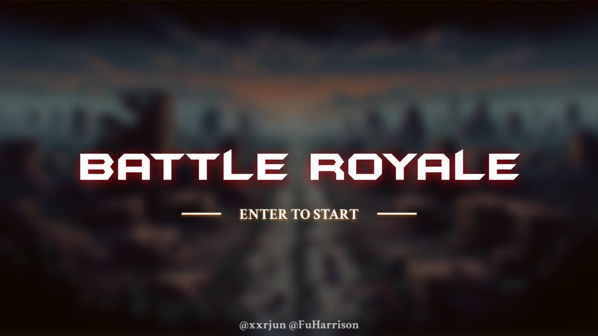

<a name="readme-top"></a>

<!-- PROJECT SHIELDS -->
<!--
*** I'm using markdown "reference style" links for readability.
*** Reference links are enclosed in brackets [ ] instead of parentheses ( ).
*** See the bottom of this document for the declaration of the reference variables
*** for contributors-url, forks-url, etc. This is an optional, concise syntax you may use.
*** https://www.markdownguide.org/basic-syntax/#reference-style-links
-->
[![Contributors][contributors-shield]][contributors-url]
[![Forks][forks-shield]][forks-url]
[![Stargazers][stars-shield]][stars-url]
<!-- [![MIT License][license-shield]][license-url] -->

# Battle Royale

> MIS 109403019 鄒翔宇, MIS 109403021 傅珩洵

<!-- 中英版文件 -->
<!-- @TODO -->
<!-- [English](./README.md) | [中文](./README_zh.md) -->

<br />
<div align="center">
  <a href="https://github.com/xxrjun/battle-royale">
    
  </a>

  <h3 align="center">Battle Royale Game</h3>

  <p align="center">
     NCU Assembly | Fall 2023 | Final Project
    <br />
    <a href="./docs/development.adoc"><strong>Explore the devlopement docs »</strong></a>
    <br />
    <br />
    <!-- <a href="">View Demo</a> -->
  </p>
</div>


<!-- TABLE OF CONTENTS -->
- [Battle Royale](#battle-royale)
  - [開發工具](#開發工具)
    - [程式開發](#程式開發)
    - [影音素材](#影音素材)
  - [遊戲規則](#遊戲規則)
  - [開始遊戲](#開始遊戲)
    - [下載專案](#下載專案)
    - [直接執行](#直接執行)
    - [使用 Makefile 進行編譯](#使用-makefile-進行編譯)
  - [遊戲流程](#遊戲流程)
  - [貢獻者](#貢獻者)


## 開發工具

### 程式開發

- [MASM32 SDK](https://www.masm32.com/index.htm) - 工具集，包含 assembler、editor、linker 等工具
  - Assembler: `ml.exe` 用於將組合語言源代碼轉換成機器代碼。
  - Linker: `link.exe` 用於將組譯器產生的對象檔案連結成可執行檔案。
- [Visual Studio Code](https://code.visualstudio.com/) 或 MASM32 SDK 中附帶的 [MASM Editor](https://www.masm32.com/) - 編輯器，用於編寫組合語言程式碼
- [ChatGPT](https://chat.openai.com/) with GPT4.0 - 協作工具，詢問程式碼、開發問題等

### 影音素材

- [DALL·E](https://openai.com/dall-e-3) - 圖片生成工具，用於製作遊戲素材
- [MusicGen](https://huggingface.co/spaces/facebook/MusicGen) - 音樂生成工具，用於製作遊戲音效
- [Mixkit](https://mixkit.co/free-sound-effects/game/) - 遊戲音效素材
 Editor)：** [Visual Studio Code](https://code.visualstudio.com/), [MASM Editor](https://www.masm32.com/)

## 遊戲規則

<!-- @TODO: Add game design -->

## 開始遊戲

### 下載專案

```bash
git clone git@github.com:xxrjun/battle-royale.git
# or
git clone https://github.com/xxrjun/battle-royale.git
```

### 直接執行

```bash
cd battle-royale/bin
battle_royale.exe 
# or
./battle_royale.exe
```

### 使用 Makefile 進行編譯

> 需要安裝 [MASM32](https://www.masm32.com/index.htm)

```bash
make # or make all
```

## 遊戲流程

<!-- @TODO: Add flowchart -->

## 貢獻者

<table>
  <tr>
 <td align="center"><a href="https://github.com/xxrjun"><br /><sub><b>xxrjun</b></sub></a><br/></td>
  
 <td align="center"><a href="https://github.com/FuHarrison"><br /><sub><b>FuHarrison</b></sub></a><br/></td>
</table>

[contributors-shield]: https://img.shields.io/github/contributors/xxrjun/battle-royale.svg?style=for-the-badge
[contributors-url]: https://github.com/xxrjun/battle-royale/graphs/contributors
[forks-shield]: https://img.shields.io/github/forks/xxrjun/battle-royale.svg?style=for-the-badge
[forks-url]: https://github.com/xxrjun/battle-royale/network/members
[stars-shield]: https://img.shields.io/github/stars/xxrjun/battle-royale.svg?style=for-the-badge
[stars-url]: https://github.com/xxrjun/battle-royale/stargazers
<!-- [license-shield]: https://img.shields.io/github/license/xxrjun/battle-royale.svg?style=for-the-badge
[license-url]: https://github.com/xxrjun/battle-royale/blob/master/LICENSE.txt -->